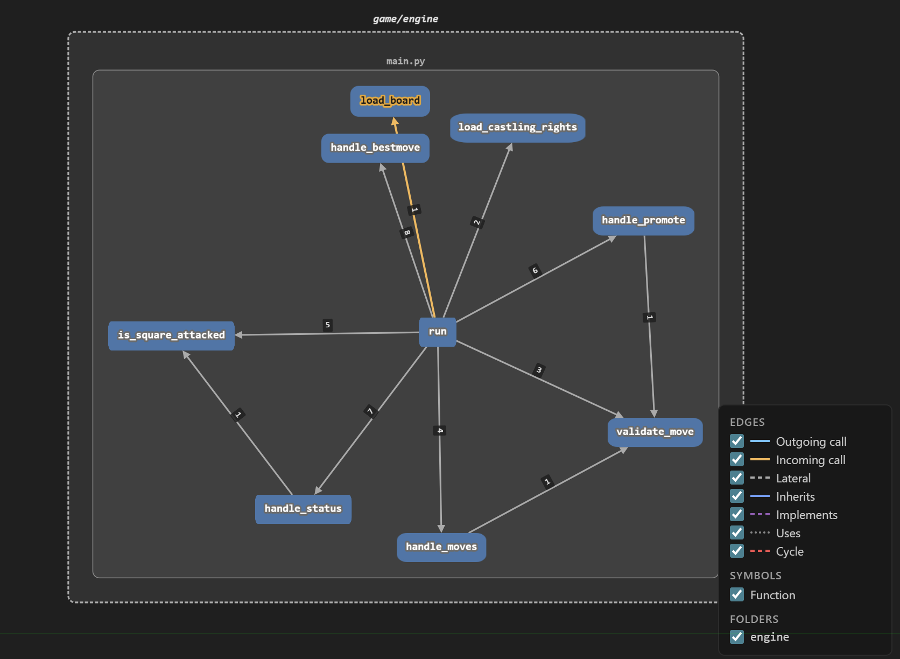
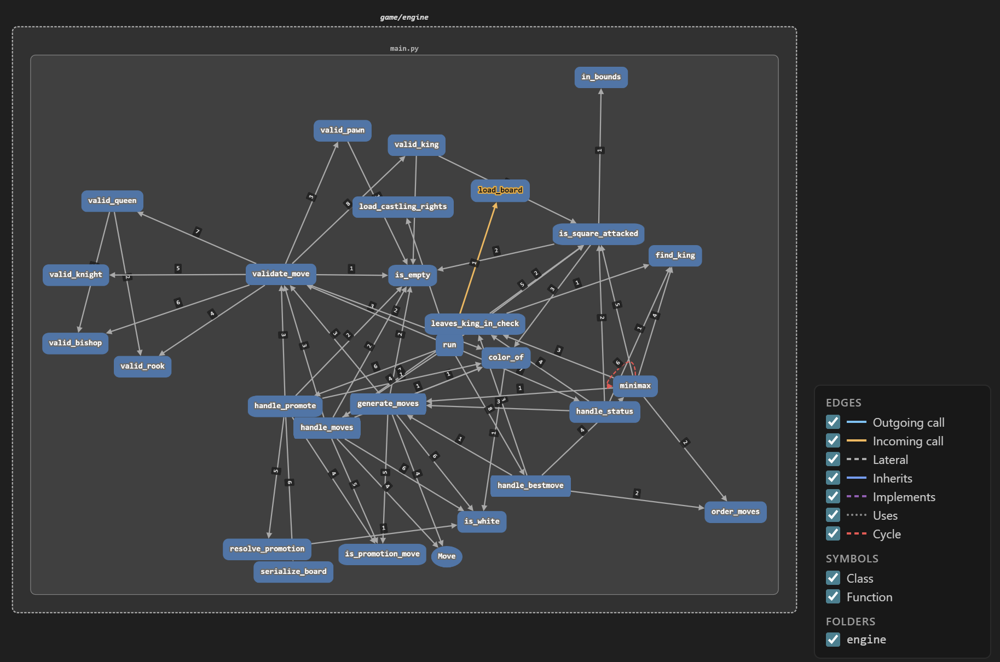
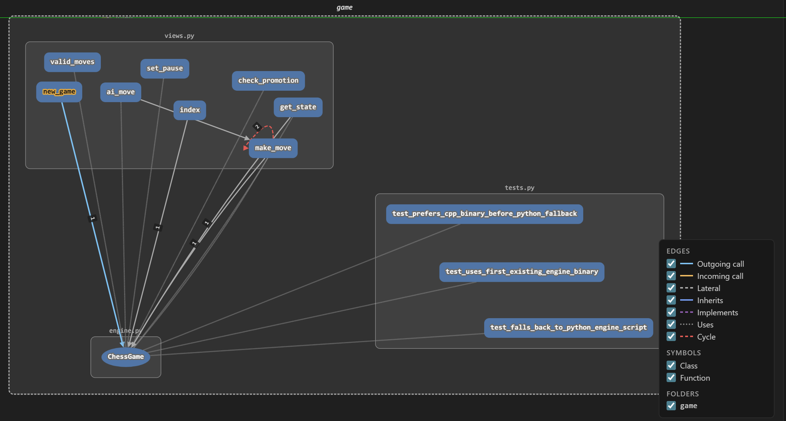

# ♟️ Checkora: Architecture & Engine Structure

> **Welcome to the Checkora Backend!**
> This guide is designed to help new contributors (tracking **Issue #49**) understand the macro-level backend architecture, data flow, and the inner workings of our AI game engine.

---

## 🏗️ High-Level Overview

Checkora is an open-source chess platform built upon the **Django** web framework. Django acts as the central hub, accepting player inputs from the website and sending them into our core AI chess engine to construct the next state. 

**The Hybrid Strategy**  
To guarantee a lightning-fast but crash-proof experience, we utilize a dual-engine architecture:
- 🚀 **Primary Engine (C++)**: Extremely fast at processing millions of calculations to power the engine's AI.
- 🐍 **Fallback Engine (Python)**: An exact structural replica of the C++ engine. If the deployment server ever lacks permissions to run the compiled C++ binary, Checkora securely falls back to Python execution so the game never crashes.

---

## 🌐 Macro-Level Architecture

The macro-level outlines how our high-level Python application logic orchestrates the game state and initiates isolated engine requests.

### 1. The Controllers (`views.py`)
This file holds the API endpoints that power the frontend interface events:
*   **`make_move`**: Processes a player's physical turn, routing the coordinates to verify mathematical legitimacy.
*   **`new_game`**: Wipes the history logs and instantiates a clean board layout for a fresh PvE or PvP match.
*   **`ai_move`**: Prompts the engine's AI subsystem to compute and execute an optimal calculated response.

### 2. The Translator (`engine.py` & `ChessGame`)
Rather than relying on `views.py` to execute raw chess mechanics, we interact entirely through the `ChessGame` wrapper. 
*   **State Translation**: Converts the complex Python-dictionary chessboard state into a flat, robust text string that the engine can immediately interpret.
*   **Subprocessing Loop**: Spawns the backend engine discreetly in the background, pushes the text command into standard IO, and records the answer.

### 3. The Guardians (`tests.py`)
This suite enforces architectural resilience through rigorous mock and integration tests.
*   **Fallback Enforcement**: Confirms the hybrid execution strategy systematically prioritizes the compiled binary, while explicitly trapping environments requiring the dynamic Python translation.

---

## ⚙️ Micro-Level Engine Logic

This section peers directly into the engine's core (`main.py` & `main.cpp`), detailing execution immediately after the Django wrapper initiates contact.

### **1. The Command Dispatcher (`run`)**
Consider `run()` the processing lobby. When the engine establishes an instance, it binds to standard input in a continuous loop. Processing a string extracts a primary directive, bouncing to precise handlers:
*   **`MOVES`** -> Activates `handle_moves` to dump pseudo-legal grid targets.
*   **`BESTMOVE`** -> Bridges to `handle_bestmove` triggering full AI activation matrices.

### **2. Move Validation Pipeline**
Any user displacement must be heavily audited through `validate_move`.
*   The system scans the active piece parameter.
*   It distributes execution to rigid piece-specific algorithmic barriers (e.g., `valid_knight`, `valid_bishop`, `valid_queen`). 
*   This structure comprehensively halts illegal traversals (like knights moving linearly, or rooks bypassing colliding subjects horizontally).

### **3. The AI Brain (`minimax`)**
Encountering the engine directly taps into the `minimax` evaluation framework.
*   **Recursive Calculation**: As an advanced recursion engine, it layers upon itself repeatedly to map branching game states extensively into the future.
*   **Move Generation (`generate_moves`)**: Extracts every legal response dynamically to feed extensive evaluation trees.
*   **Danger Evaluation Validation**: To prevent terminal blunders, AI movement proposals are structurally clamped using `leaves_king_in_check` alongside `is_square_attacked` before officially adopting a route.

---

## 🔄 End-to-End Execution Flow

Below is the concrete data lifecycle generated when you grab a piece and execute your turn:

| Step | Action Layer | System Response |
| :---: | :--- | :--- |
| **1** | **🖥️ Frontend UI** | The player drags their piece dynamically across the grid. An API `POST` is immediately triggered. |
| **2** | **🔗 Django Views** | Incoming endpoints (`views.py`) trap the grid coordinates, reloading the active JSON session. |
| **3** | **📦 Wrapper Sync** | The `ChessGame` instance translates state layouts entirely to pure terminal commands, initializing the Python or C++ engine IO pipeline. |
| **4** | **🛡️ Engine Logic** | The terminal `run()` loop catches the stream, parses validation barriers (`validate_move`), and issues a strict boolean textual acceptance. |
| **5** | **✅ Broadcast** | The wrapper processes the safe engine response, updating the server logs and signaling Django responses back to your screen. |
